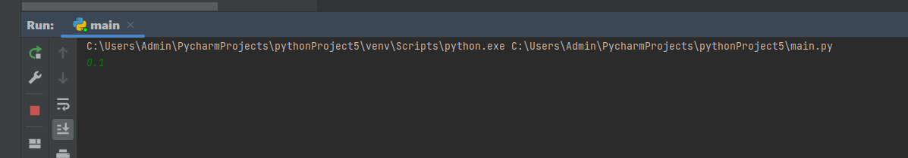
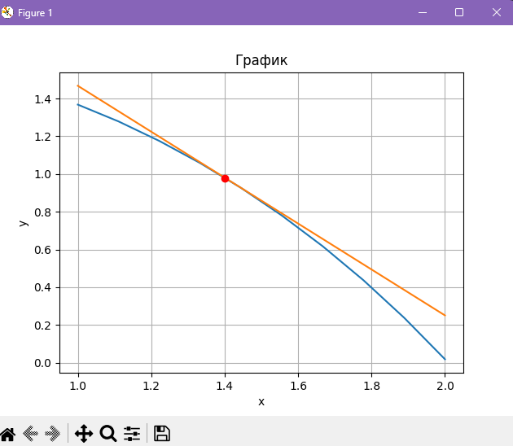

## Задание

Сложность:
    Rare

    1. Создайте в каталоге для данной ЛР в своём репозитории виртуальное окружение и установите в него matplotlib и numpy. Создайте файл requirements.txt.
        2. Откройте книгу [1] и выполните уроки 1-3. Первый урок можно начинать со стр. 8.
        3. Выберите одну из неразрывных функции своего варианта из лабораторной работы №2, постройте график этой функции и касательную к ней. Добавьте на график заголовок, подписи осей, легенду, сетку, а также аннотацию к точке касания.
        4. Добавьте в корень своего репозитория файл .gitignore отсюда, перед тем как делать очередной коммит.
        5. Оформите отчёт в README.md. Отчёт должен содержать:
            5.1. графики, построенные во время выполнения уроков из книги
            5.2. объяснения процесса решения и график по заданию 4
        6. Склонируйте этот репозиторий НЕ в ваш репозиторий, а рядом. Изучите использование этого инструмента и создайте pdf-версию своего отчёта из README.md. Добавьте её в репозиторий.

## Отчет

## Этапы работы

### 1. Задание по Варианту №1


### 2. Код

```python
import math
import matplotlib.pyplot as plt
import numpy as np

def f(x):
    return math.exp(-x*x) - x*x + 2*x

def f_pr(x):
    return (-x*x - 1)*math.exp(-x*x) - 2*x + 2
h = float(input())
h = round(1/h)
x = np.linspace(1,2,h)
y = []
for i in x:
    y.append(f(i))
x1 = [1.0, 2.0]
y1 =[]
for i in x1:
    y1.append(f(1.4) + f_pr(1.4) * (i - 1.4))
plt.title('График')
plt.xlabel('x')
plt.ylabel('y')
plt.grid()
plt.plot(x, y)
plt.plot(x1, y1)
plt.plot(1.4, 0.978, "ro")
plt.show()
```

### 3. Результаты
#### Нужно вводить значения меньше еденицы!


#### График по варианту



#### График по уроку 1


#### График по уроку 2


#### График по уроку 3


### 4. Список использованных источников

1. https://evil-teacher.on.fleek.co/books/prog_pm/matplotlib.pdf
