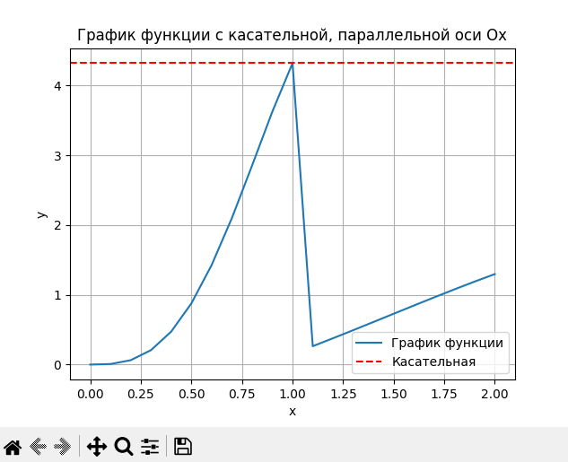
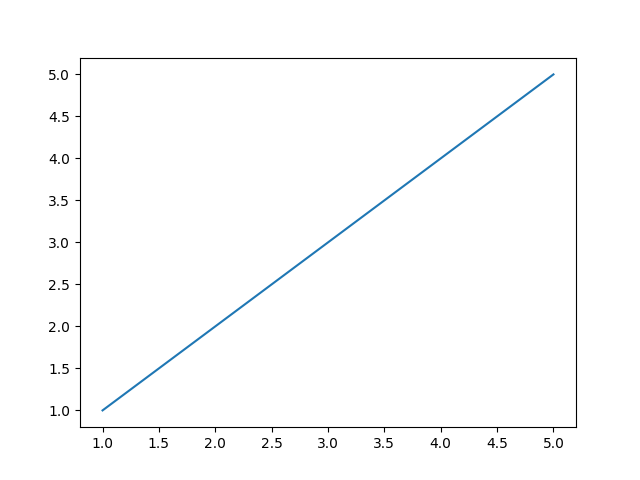
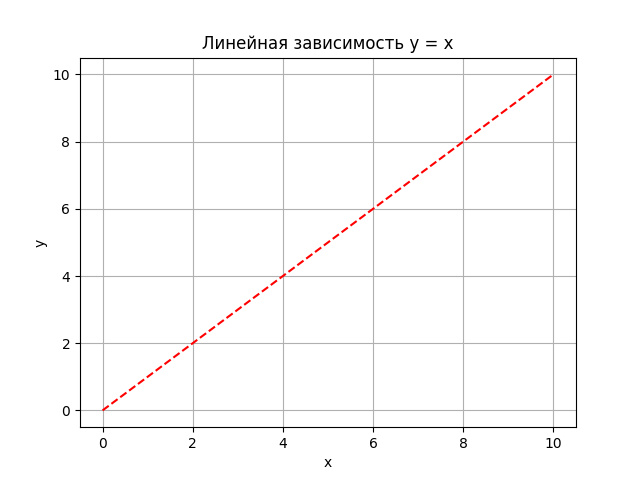
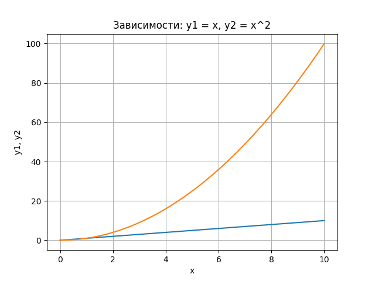

## Задание 
Сложность:
    Rare
        
        1. Создайте в каталоге для данной ЛР в своём репозитории виртуальное окружение и установите в него matplotlib и numpy. Создайте файл requirements.txt.
        2. Откройте книгу [1] и выполните уроки 1-3. Первый урок можно начинать со стр. 8.
        3. Выберите одну из неразрывных функции своего варианта из лабораторной работы №2, постройте график этой функции и касательную к ней. Добавьте на график заголовок, подписи осей, легенду, сетку, а также аннотацию к точке касания.
        4. Добавьте в корень своего репозитория файл .gitignore отсюда, перед тем как делать очередной коммит.
        5. Оформите отчёт в README.md. Отчёт должен содержать:
            5.1. графики, построенные во время выполнения уроков из книги
            5.2. объяснения процесса решения и график по заданию 4
        6. Склонируйте этот репозиторий НЕ в ваш репозиторий, а рядом. Изучите использование этого инструмента и создайте pdf-версию своего отчёта из README.md. Добавьте её в репозиторий.
## Отчет

## Этапы работы
### 1. Задание по Варианту №6


### 2. Код
```python
import math
import numpy as np
import matplotlib.pyplot as plt

# Чтение данных из текстового файла
with open('my_graph.txt', 'r') as file:
    data = file.readlines()

# Разделение координат на x и y
x = []
y = []
for line in data:
    line = line.strip().split('\t')
    x.append(float(line[0]))
    y.append(float(line[1]))

x0 = 0
y0 = 4.322418

# Построение графика функции
plt.plot(x, y, label='График функции')

plt.axhline(y0,  label='Касательная', color='r', linestyle='--')

plt.title('График функции с касательной, параллельной оси Ox')
plt.xlabel('x')
plt.ylabel('y')
plt.legend()
plt.grid(True)
plt.show()
```

### 3. Результаты
#### График по варианту

#### График по уроку 1

#### График по уроку 2

#### График по уроку 3


### 4. Список использованных источников 
1. https://evil-teacher.on.fleek.co/books/prog_pm/matplotlib.pdf
